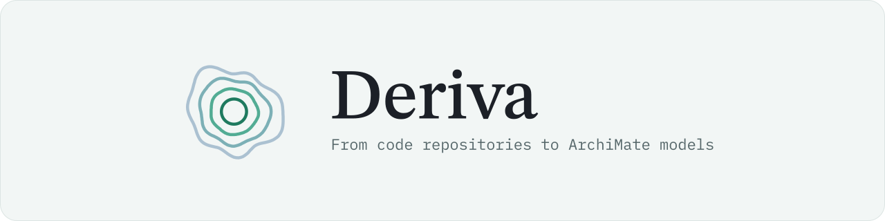
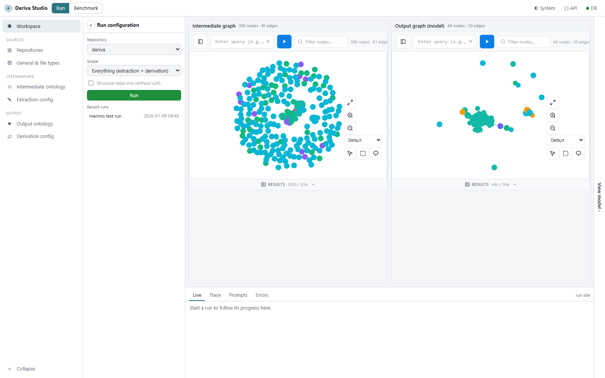

<picture>
  <source media="(prefers-color-scheme: dark)" srcset="assets/brand/deriva-banner-dark.svg">
  
</picture>

# Deriva
[](#)
[](https://github.com/StevenBtw/Deriva/actions/workflows/ci.yml)
[](LICENSE)
[](https://www.python.org/downloads/)
[](https://github.com/StevenBtw/grafeo)
[](#studio)

**From code repositories to ArchiMate models.**

Deriva reads a software repository, builds a graph of what is in it, and derives an [ArchiMate](https://www.opengroup.org/archimate-forum) enterprise architecture model you can open in [Archi](https://www.archimatetool.com/).

<picture>
  <source media="(prefers-color-scheme: dark)" srcset="assets/studio-dark.png">
  
</picture>

## How It Works

Deriva works from the outside in, like its mark: repository, intermediate graph, output graph, ArchiMate model. Parsing and graph algorithms find the structure; an LLM reads what needs reading. Every prompt is versioned configuration you can open and change.

1. **Repository** (clone): the code as it is, a Git repository cloned locally. Deriva classifies every file by type, from source and config to docs, tests and build files.
2. **Intermediate graph** (extract): parsing (tree-sitter for most languages) turns the code into a graph of directories, files, types, methods, dependencies, technologies and business concepts. Graph metrics (PageRank, Louvain communities, k-core) then rank what matters.
3. **Output graph** (derive): graph structure picks the candidates; an LLM classifies and names them within ArchiMate's rules, then refine steps tidy the result. The studio shows both graphs side by side.
4. **ArchiMate model** (export): the output graph exports in the Open Group ArchiMate exchange format, ready to open in Archi.

## Quick Setup

Deriva runs on your own machine: Deriva Studio in your browser, the pipeline and its embedded databases locally. Nothing is sent anywhere except the prompts to the LLM you choose.

### Requirements

- **Python 3.14**. uv downloads it for you if it is missing.
- **uv**, the Python package manager (step 1).
- **Git**, to clone Deriva and the repositories you analyse.
- **Node 22**, to build the studio's front end from a source checkout.
- **An LLM**: an API key for Azure OpenAI, OpenAI, Anthropic or Mistral, or a local model in Ollama or LM Studio.

### 1. Install uv

Windows (PowerShell):

```bash
powershell -ExecutionPolicy ByPass -c "irm https://astral.sh/uv/install.ps1 | iex"
```

macOS and Linux:

```bash
curl -LsSf https://astral.sh/uv/install.sh | sh
```

### 2. Clone Deriva and create your settings

```bash
git clone https://github.com/StevenBtw/Deriva.git
cd Deriva
cp .env.example .env
```

All settings live in `.env`. Set up an LLM there before your first run ([how](#set-up-an-llm)).

### 3. Install the dependencies

```bash
uv sync
```

This creates `.venv` with Python 3.14 and installs everything, including the spaCy pipelines (English, German and French) that find business concepts in documentation.

### 4. Build the studio, once

```bash
cd studio
npm install
npm run build
cd ..
```

This writes the front end into the Python package, which serves it. Build again after you pull changes to `studio/`.

### 5. Start Deriva Studio

```bash
uv run deriva
```

Open http://127.0.0.1:8765. On its first start Deriva sets up its configuration database with the default steps; nothing to do. The studio listens on this machine only; `--port` picks another port, and the API documentation is at `/docs`.

---

## Set Up an LLM

Each model gets a block of `LLM_{NAME}_*` settings in `.env`, and `LLM_DEFAULT_MODEL` picks the one Deriva uses. The default model is the name in lowercase with hyphens: `LLM_MISTRAL_DEVSTRAL_*` becomes `mistral-devstral`.

```bash
# .env: a cloud model
LLM_DEFAULT_MODEL=mistral-devstral
LLM_MISTRAL_DEVSTRAL_PROVIDER=mistral
LLM_MISTRAL_DEVSTRAL_MODEL=devstral-2512
LLM_MISTRAL_DEVSTRAL_URL=https://api.mistral.ai/v1/chat/completions
LLM_MISTRAL_DEVSTRAL_KEY=your-mistral-api-key
LLM_MISTRAL_DEVSTRAL_STRUCTURED_OUTPUT=true
```

A local model needs no key:

```bash
# .env: a local model in Ollama
LLM_DEFAULT_MODEL=ollama-devstral
LLM_OLLAMA_DEVSTRAL_PROVIDER=ollama
LLM_OLLAMA_DEVSTRAL_MODEL=devstral-small-2
LLM_OLLAMA_DEVSTRAL_URL=http://localhost:11434/api/chat
```

| Provider | For |
|----------|-----|
| `azure` | Azure OpenAI |
| `openai` | OpenAI |
| `anthropic` | Anthropic |
| `mistral` | Mistral |
| `ollama` | Ollama, local |
| `lmstudio` | LM Studio, local |

`STRUCTURED_OUTPUT=true` lets the API enforce the JSON schema (OpenAI, Anthropic, Mistral and Ollama). Rate limits, retries and the response cache have defaults; `.env.example` lists every setting.

---

## Using Deriva

### Analyse your first repository

1. Open **Repositories** in the studio's menu and choose **+ Clone repository**. Enter the Git URL; a name and a branch are optional.
2. Open the **Workspace**, pick the repository and a scope, and press **Run**. **Structural steps only (without LLM)** gives a first look without any LLM calls.
3. Follow the run in the tabs at the bottom: **Live**, **Trace**, **Prompts** and **Errors**. The intermediate graph and the output graph fill in side by side.
4. **View model**, on the right edge, opens the output graph as an ArchiMate diagram; click an element for its details.

### Export to Archi

Deriva writes the model in the Open Group ArchiMate exchange format. From the studio: open **View model** and press **Export XML**; it writes `workspace/output/model.xml` on the machine that runs the studio. Or from the command line:

```bash
uv run deriva-cli export -o workspace/output/model.xml --repo my-repo
```

In Archi, choose **File**, **Import**, **Open Exchange XML Model** and pick the file.

### Change a prompt

1. Open **Extraction config** or **Derivation config** in the menu.
2. Pick a step and edit its instruction or example. Every LLM step follows the same pattern: input, instruction, example.
3. Press **Save as new version**. Earlier versions stay in the history, and each step can be switched on or off.

Run the repository again to see the effect.

---

## Configuration

### Environment Variables (.env)

All configuration lives in `.env`. Key settings:

```bash
# Graph database (grafeo embedded)
GRAFEO_DB_DIR=           # Empty = in-memory; directory = one <repo>.grafeo database per repository

# LLM Provider (mistral, openai, azure, anthropic, ollama, lmstudio)
LLM_MISTRAL_DEVSTRAL_PROVIDER=mistral
LLM_MISTRAL_DEVSTRAL_MODEL=devstral-2512
LLM_MISTRAL_DEVSTRAL_URL=https://api.mistral.ai/v1/chat/completions
LLM_MISTRAL_DEVSTRAL_KEY=your-mistral-api-key
LLM_MISTRAL_DEVSTRAL_STRUCTURED_OUTPUT=true

# Namespaces
GRAPH_NAMESPACE=Graph
ARCHIMATE_NAMESPACE=Model

# NLP translation models for business concepts (default shown)
DERIVA_NLP_MODELS_DIR=workspace/cache/nlp
```

See `.env.example` for all available options.

### Rate Limiting

The LLM adapter includes built-in rate limiting to prevent API throttling:

```bash
# Requests per minute (0 = use provider default: 60 RPM for cloud, unlimited for local)
LLM_RATE_LIMIT_RPM=0

# Minimum delay between requests in seconds
LLM_RATE_LIMIT_DELAY=0.0

# Max retries on rate limit (429) errors
LLM_RATE_LIMIT_RETRIES=3

# Adaptive throttling (reduces RPM when hitting rate limits)
LLM_THROTTLE_ENABLED=true
LLM_THROTTLE_MIN_FACTOR=0.25    # Minimum 25% of configured RPM
LLM_THROTTLE_RECOVERY_TIME=60   # Seconds before trying to increase RPM

# Circuit breaker (stops requests when provider is failing)
LLM_CIRCUIT_BREAKER_ENABLED=true
LLM_CIRCUIT_FAILURE_THRESHOLD=5   # Consecutive failures to open circuit
LLM_CIRCUIT_RECOVERY_TIME=30      # Seconds before testing recovery
```

Default rate limits by provider:

| Provider | Default RPM |
|----------|-------------|
| OpenAI | 30 |
| Anthropic | 30 |
| Mistral | 24 |
| Ollama | Unlimited |
| LM Studio | Unlimited |

The rate limiter automatically:

- Throttles requests to stay within limits
- Applies exponential backoff on rate limit errors (HTTP 429)
- Respects Retry-After headers from providers
- Adaptively reduces RPM when hitting rate limits (recovers over time)
- Opens circuit breaker after consecutive failures to prevent cascading errors

### Managing File Types

If you encounter **undefined extensions** during extraction:

**Via the studio:**

1. Open **General & file types** in the menu
2. Add them to the registry:
   - Extension (e.g., `.tsx`, `Dockerfile`)
   - Type (source, config, docs, test, build, asset, data, exclude)
   - Subtype (e.g., `typescript`, `docker`)

**Via CLI:**

```bash
# List all registered file types
uv run deriva-cli config filetype list

# Add a new file type
uv run deriva-cli config filetype add ".tsx" source typescript

# Delete a file type
uv run deriva-cli config filetype delete ".tsx"

# Show file type statistics by category
uv run deriva-cli config filetype stats
```

> **Note:** Files with unrecognized extensions are automatically classified as `file_type="unknown"` with their extension as the subtype. This ensures all files get proper classification even without explicit registry entries.

**Excluded directories:** dependency and tool directories are skipped by every repository walk (no Directory or File nodes, no LLM calls), matched as whole path segments. The list is the `excluded_directories` system setting (JSON list); by default `.git`, `__pycache__`, `node_modules`, `bower_components`, `vendor`, `.venv`, `venv` and `site-packages`. Changing it triggers re-extraction.

```bash
uv run deriva-cli config setting show excluded_directories
uv run deriva-cli config setting set excluded_directories '[".git", "node_modules", "third_party"]'
```

**Derivation name patterns:** some derivation steps use include and exclude patterns on the names of their code candidates; business concepts are already classified and skip them. Most of these steps reject a name that contains an exclude pattern and keep one that contains an include pattern, and a name that matches neither follows the step's default (rejected by most steps, kept by BusinessFunction, ApplicationInterface, SystemSoftware and TechnologyService). BusinessObject (type definitions) and BusinessEvent (methods) use the patterns to rank candidates instead, and fill their remaining slots with names that did not match. A step that uses the default candidate filter (ApplicationComponent, ApplicationInterface, BusinessFunction, DataObject, Device, Node, SystemSoftware, TechnologyService) can limit the patterns to candidates with given graph labels with its `pattern_labels` param, and set a k-core threshold with `graph_filter`. Patterns are stored per step, type and category.

```bash
uv run deriva-cli config pattern list Node
uv run deriva-cli config pattern add Node include deployment helm
uv run deriva-cli config pattern delete Node include --category deployment helm   # a category left empty is deactivated
```

### Updating Configurations (Versioning)

Deriva uses a **versioning system** for configurations. When you update a config, a new version is created while preserving previous versions for rollback.

**Correct ways to update configs:**

1. **Via the studio**: open **Extraction config** or **Derivation config**, edit the instruction or example, and click **"Save as new version"**
2. **Via CLI**: Use the `config update` command

```bash
# Update extraction config instruction
uv run deriva-cli config update extraction BusinessConcept \
  -i "New instruction text..."

# Update extraction config with batch size for multi-file LLM calls
uv run deriva-cli config update extraction BusinessConcept \
  --batch-size 5

# Update derivation config from file
uv run deriva-cli config update derivation ApplicationComponent \
  --instruction-file prompts/app_component.txt

# View all versions
uv run deriva-cli config versions
```

**Do NOT use JSON import/export for config updates.** The `db_tool import` command is only for backup restoration or migration - it overwrites version history. See [BENCHMARKS.md](BENCHMARKS.md) for the optimization workflow.

### Customizing Extraction Prompts

For LLM-assisted extraction steps:

1. Open **Extraction config** in the studio's menu and pick a step (e.g., BusinessConcept)
2. Edit its input sources, instruction, example or params
3. Press **Save as new version**; earlier versions stay in the history

All prompts follow the **Input + Instruction + Example** pattern.

---

## Studio

The studio is Deriva's local web UI (`uv run deriva`): a FastAPI backend over `PipelineSession` and a React front end.

| Area | Purpose |
|------|---------|
| **Workspace** | Run the pipeline (repository, scope, structural steps only), follow it live, see the intermediate graph and the output graph side by side, open the ArchiMate model |
| **Repositories** | Clone, inspect and delete repositories |
| **General & file types** | System settings (excluded directories) and the file type registry |
| **Extraction / Derivation config** | Step tables with versions; edit instructions and examples, save as a new version, switch steps on or off |

The graphs use [anywidget-graph](https://github.com/GrafeoDB/anywidget-graph) (its query bar runs read-only Cypher against the embedded databases) and the model uses [anywidget-archimate](https://github.com/StevenBtw/anywidget-archimate). While a CLI run holds the databases, the studio says so and shows what it can.

For front-end development, run `uv run deriva` and, in `studio/`, `npm run dev` (Vite forwards the API to port 8765); `npm test`, `npm run lint` and `npm run typecheck` check it.

---

## Data Storage

- **Grafeo** (embedded graph database):
  - **Graph namespace**: the intermediate graph (directories, files, types, methods, dependencies, technologies, business concepts)
  - **Model namespace**: the output graph (ArchiMate elements and relationships)
- **DuckDB** (`deriva/adapters/database/sql.db`): step configurations with their versions, file types, name patterns and settings; created on first use from the shipped seed data

### Clearing Data

**Via the API** (`DELETE /api/graph`, `DELETE /api/model`) or the CLI (`deriva-cli clear graph|model`):

- **Clear Graph**: Removes all nodes/edges from Graph namespace
- **Clear Model**: Removes all ArchiMate elements and relationships

---

## Querying the Graph

Each graph panel in the Workspace has a query bar that runs read-only Cypher against the embedded Grafeo database. A few to start with:

```cypher
// All repositories
MATCH (r:Graph:Repository) RETURN r.repoName, r.url

// The files of one repository, with their type
MATCH (repo:Graph:Repository)-[:`Graph:CONTAINS`*]->(f:Graph:File)
WHERE repo.repoName = 'my-repo'
RETURN f.filePath, f.fileType

// Type definitions
MATCH (td:Graph:TypeDefinition) RETURN td.typeName, td.category, td.filePath
```

---

## CLI (Headless Mode)

`uv run deriva` starts the studio; `uv run deriva-cli` runs the same pipeline without it, for scripts and automation.

```bash
uv run deriva-cli repo clone https://github.com/user/my-repo.git
uv run deriva-cli repo list
uv run deriva-cli run all --repo my-repo -v
uv run deriva-cli run extraction --repo my-repo --no-llm
uv run deriva-cli status
uv run deriva-cli export -o workspace/output/model.xml --repo my-repo
uv run deriva-cli --help
```

| Option | Does |
|--------|------|
| `--repo NAME` | Runs one repository (default: all) |
| `--phase PHASE` | Runs one phase: classify or parse (extraction), prep, generate or refine (derivation) |
| `--only-step STEP` | Runs a single step |
| `--no-llm` | Skips the LLM steps (structure only) |
| `-v` | Prints detailed progress |
| `-o PATH` | Where `export` writes the model |

Configuration from the command line:

```bash
# View configuration
uv run deriva-cli config list extraction
uv run deriva-cli config show extraction BusinessConcept

# Add a derivation step (created disabled, then enable it); a refine step
# must also be implemented and registered in code under the same name
uv run deriva-cli config add derivation my_refine_step --phase refine --sequence 4 --params '{"dry_run": true}'
uv run deriva-cli config enable derivation my_refine_step

# Manage file types
uv run deriva-cli config filetype list
uv run deriva-cli config filetype add ".lock" dependency lock
uv run deriva-cli config filetype stats

# System settings (e.g. directories skipped during extraction)
uv run deriva-cli config setting show excluded_directories

# Derivation name patterns (include and exclude, per step and category)
uv run deriva-cli config pattern list SystemSoftware
```

---

## Benchmarking

Deriva includes a multi-model benchmarking system for comparing LLM performance across different providers and models. See [BENCHMARKS.md](BENCHMARKS.md) for the full guide and [OPTIMIZATION.md](OPTIMIZATION.md) for detailed case studies.

### Running Benchmarks

```bash
# List available benchmark models
uv run deriva-cli benchmark models

# Run a benchmark with specific models
uv run deriva-cli benchmark run \
  --repos flask_invoice_generator \
  --models openai-gptx,ollama-devstral \
  -n 3 \
  -d "Comparing gptx with devstral" \
  -v

# List benchmark sessions
uv run deriva-cli benchmark list

# Analyze a benchmark session
uv run deriva-cli benchmark analyze bench_20260101_150724
```

### Configuring Benchmark Models

Add models to `.env` using the pattern:

```bash
# Azure GPT-4o-mini
LLM_AZURE_GPT4MINI_PROVIDER=azure
LLM_AZURE_GPT4MINI_MODEL=gpt-4
LLM_AZURE_GPT4MINI_URL=https://your-resource.openai.azure.com/...
LLM_AZURE_GPT4MINI_KEY=your-api-key

# Ollama local model
LLM_OLLAMA_LLAMA_PROVIDER=ollama
LLM_OLLAMA_LLAMA_MODEL=devstral
LLM_OLLAMA_LLAMA_URL=http://localhost:11434/api/chat
```

### OCEL Event Logging

Benchmark runs are logged in **OCEL 2.0** (Object-Centric Event Log) format for process mining analysis:

- Events capture pipeline stages, LLM calls, and results
- Object types: `BenchmarkSession`, `BenchmarkRun`, `Repository`, `Model`
- Logs are saved to `workspace/benchmarks/{session_id}/events.ocel.json`

OCEL files can be analyzed with process mining tools like PM4Py, Celonis, or custom analysis scripts.

---

## Troubleshooting

### The studio shows a "not built yet" page

The front end is missing: build it ([step 4](#4-build-the-studio-once)) and reload.

### A banner says the databases are held

A command line run, for example a benchmark, has the databases open. The studio shows what it can and carries on when that run finishes.

### The wrong Python, or a broken install

```bash
uv run python --version  # 3.14 or newer
uv sync --reinstall
```

### The business concept step cannot download its models

On its first run this step downloads translation models into `workspace/cache/nlp` and checks them by SHA-256. Check that the machine can reach the model host and run the step again. `DERIVA_NLP_MODELS_DIR` in `.env` moves the folder.

---

## Contributing

For development setup, architecture details, and contribution guidelines, see [CONTRIBUTING.md](CONTRIBUTING.md).

---

## License

This project is licensed under the **GNU Affero General Public License v3.0 (AGPL-3.0)**.

This means you can freely use, modify, and distribute this software, but if you run a modified version as a network service, you must make the source code available to users of that service.

See [LICENSE](LICENSE) for the full license text.

## Acknowledgments

- [FastAPI](https://fastapi.tiangolo.com) and [React](https://react.dev) - The studio
- [anywidget-graph](https://github.com/GrafeoDB/anywidget-graph) and [anywidget-archimate](https://github.com/StevenBtw/anywidget-archimate) - Graph and model views
- [Grafeo](https://github.com/GrafeoDB/grafeo) - Embedded graph database
- [ArchiMate](https://www.opengroup.org/archimate-forum) - Enterprise architecture standard
- [Archi](https://www.archimatetool.com) - Open source ArchiMate modeling tool
- [Tree-sitter](https://tree-sitter.github.io/tree-sitter/) - Multi-language AST parsing

---

**Status**: Active Development
